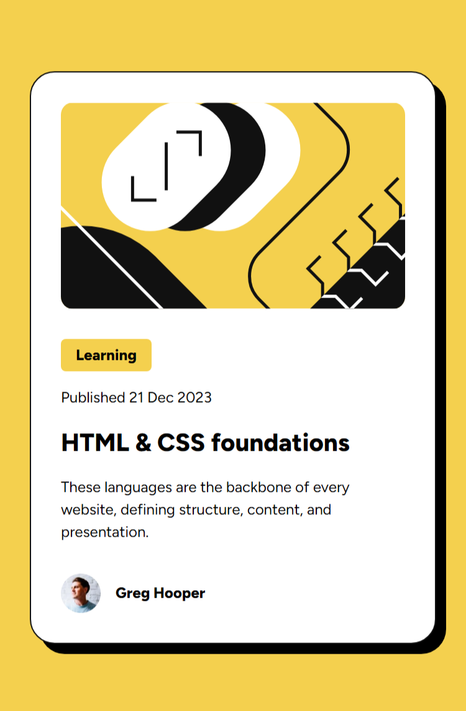

# Frontend Mentor - Blog preview card solution

This is a solution to the [Blog preview card challenge on Frontend Mentor](https://www.frontendmentor.io/challenges/blog-preview-card-ckPaj01IcS). Frontend Mentor challenges help you improve your coding skills by building realistic projects.

## Table of contents

- [Overview](#overview)
  - [The challenge](#the-challenge)
  - [Screenshot](#screenshot)
  - [Links](#links)
- [My process](#my-process)
  - [Built with](#built-with)
  - [What I learned](#what-i-learned)
  - [Continued development](#continued-development)
  - [Useful resources](#useful-resources)
- [Author](#author)

## Overview

### The challenge

Users should be able to:

- See hover and focus states for all interactive elements on the page

### Screenshot

### Links

- Solution URL: 
- Live Site URL: 

## My process

### Built with

- Semantic HTML5 markup
- CSS custom properties
- Flexbox
- CSS Grid
- CSS Pseudo-classes & function
- Mobile-first workflow

### What I learned

In this challenge, I learned more about using clamps and CSS pseudo-classes such as first, nth, and last child; CSS function like clamp; maximizing the use of custom variables for repeated values used in creating this card; and use fonts .

### Continued development

Areas that I want to continue focusing on in future projects such as exploring and deepening CSS pseudo-classes and functions.

### Useful resources

- [web.dev](https://web.dev/) - This helped me for learning and exploring the use of CSS pseudo-classes, function, and using font with `@font-face`.
- [Clamp](https://www.sitepoint.com/fluid-typography-css-clamp-function/?ref=dailydev#toolsandresources) - Article + recommended tools about clamp.

## Author

- Frontend Mentor - [@Yemima20](https://www.frontendmentor.io/profile/Yemima20)